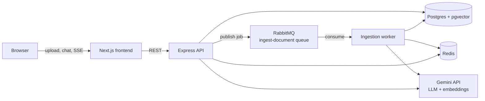
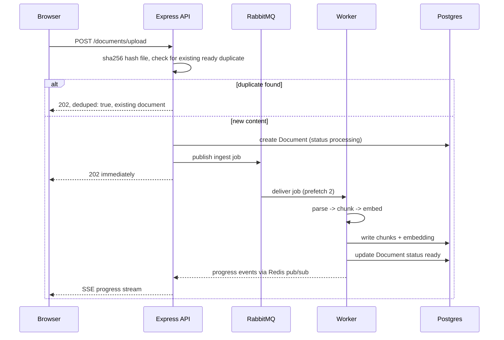
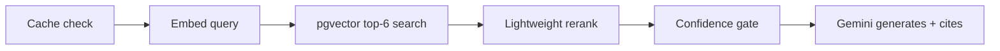
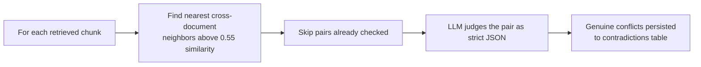
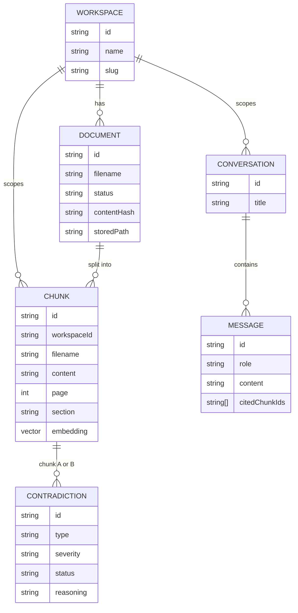
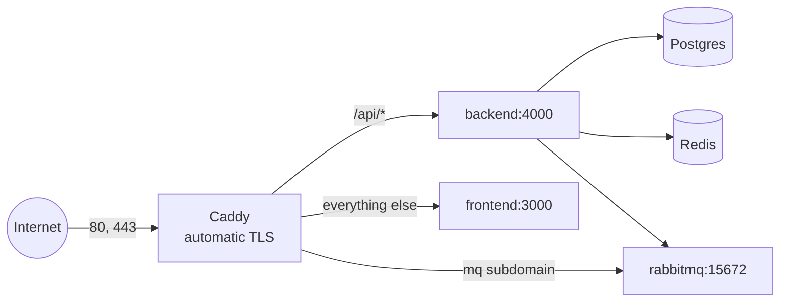

# Architecture

## Overview

The frontend never talks to Postgres, Redis, or RabbitMQ directly, every request
routes through the Express API. The worker is a separate long running process (its
own container) that does nothing but consume ingestion jobs from RabbitMQ, it calls
the embedding provider during ingestion; the API calls the LLM and embedding provider
again during chat and contradiction checks.

## 1. Ingestion

**Steps in detail:**

1. **Upload lands and gets hashed.** The API reads the file into memory and computes a
   SHA-256 hash of the raw bytes. It checks Postgres for a document in this workspace
   with that exact hash already marked `ready`. If one exists, ingestion stops here
   entirely, no parsing, no embedding, the existing document is returned with
   `deduped: true`. A short-lived Redis lock guards the narrow race where two uploads
   of the same file land within milliseconds of each other.
2. **A job is published, not processed inline.** A `Document` row is created with
   `status: processing`, and a message is published to RabbitMQ's `ingest-document`
   queue. The API responds `202` immediately, it never waits for parsing or embedding.
3. **The worker parses the file into pages of text.** PDF through `pdf-parse`, DOCX
   through `mammoth`, MD and TXT read directly.
4. **Text is split into chunks of roughly 500 to 800 tokens.** A recursive splitter
   breaks on paragraph boundaries first, target 2,800 characters with about 15 percent
   overlap between chunks, falling back to sentence boundaries for unusually long
   paragraphs. It tracks the nearest preceding heading as that chunk's section, used
   later for citations. Short documents legitimately produce exactly one chunk when
   their full text is under the target size, that is correct behavior, not a bug.
5. **Each chunk becomes a 1024 dimension vector.** Every chunk's text is sent to
   Gemini's embedding model. Calls are gated by a Redis token bucket so ingestion
   never bursts past the provider's rate limit.
6. **Chunks are written to Postgres via raw SQL for the vector column.** Prisma writes
   everything about a chunk except the embedding itself, Prisma has no native `vector`
   type, so the embedding column is set with a hand written
   `UPDATE ... SET embedding = $1::vector`, isolated to one file,
   `retrieval/vectorSearch.ts`.
7. **Status flips to ready, progress is broadcast the whole way.** The `Document` row
   moves to `status: ready`, or `error` with a human readable reason if a chunk fails
   after retries. At each stage the worker publishes a progress event over Redis
   pub/sub, the API relays it to the browser as Server-Sent Events, which animates the
   upload progress bar with no polling.

**Failure handling:** a failed job is nacked and republished with `attempt + 1` up to
3 tries, then dead lettered to `ingest-document.failed` and the document is marked
`error` with the real error message. One bad chunk does not take down the whole
document, and a bad document does not take down the queue for everything behind it.

## 2. RAG chat

1. **Redis cache check first.** The query text plus the active document set is
   hashed, a cache hit returns the previous answer instantly, skipping every step
   below.
2. **Embed the question, search pgvector.** The question is embedded the same way
   chunks were, then `chunks.embedding <=> query_vector` finds the 6 closest chunks by
   cosine distance, scoped to the workspace.
3. **Lightweight rerank.** Chunks whose section heading or filename literally
   overlaps query terms get a small score boost, no extra model call needed for this
   pass.
4. **Confidence gate.** If the top similarity score is below 0.45, the answer is
   explicitly flagged as low context instead of being presented with false
   confidence.
5. **Generate, grounded and cited.** Gemini receives a numbered context block built
   only from the retrieved chunks, plus the last 10 turns of conversation history, and
   is instructed to cite `[1][2]` matching those blocks and to say so plainly if the
   context does not contain the answer.

## 3. Contradiction detection

Runs as a side effect of the chat query above, not a separate scan the user
triggers.

The LLM judge is asked for `{ isContradiction, type, severity, reasoning, statementA,
statementB }`, and is explicitly instructed to treat "B is a later revision of A" as
not a contradiction, so updates and version bumps do not get flagged as conflicts.
Type is one of `factual`, `logical`, `temporal`, `numerical`. Severity is one of
`critical`, `warning`, `info`.

Why only nearest neighbors and not every pair of chunks: comparing all pairs is O(n
squared) in chunk count and mostly wasted, two chunks about unrelated topics cannot
meaningfully contradict. Restricting to chunks the vector index already says are
topically similar keeps LLM calls proportional to actual overlap.

## Data model

Everything above goes through the normal Prisma client. The one exception is the
`chunks.embedding` column, Prisma has no native `vector` type, so it is declared
`Unsupported("vector(1024)")` in `schema.prisma`, created via a hand written SQL
migration, and every read or write against it goes through
`retrieval/vectorSearch.ts`, the only file in the codebase with raw SQL.

**Deliberate denormalization:** `Chunk` carries its own `workspaceId` and `filename`
directly, even though both are technically derivable by joining up to `Document`.
That is on purpose. The hottest query in the whole system is "find similar chunks,
filtered to this workspace, with enough metadata to cite," run on every single chat
message. Forcing a join to `Document` for that, every time, buys nothing except a
slower query, filename and workspace do not change independently of the chunk once
it is written.

**Document preview:** `Document.storedPath` tracks where the raw uploaded file lives
on the `uploads` volume. The file was always written to disk at upload time, but the
path was never persisted anywhere, once ingestion finished the original file was
unreachable through any API even though it still existed. Adding this column and a
`/documents/:id/file` route made the original file (and, separately, its concatenated
extracted text) available for preview and download, and deleting a document now also
removes its file from disk instead of leaking it silently.

## Multi-workspace and content-hash dedup

There is no login in this build. A workspace's URL slug is its access control,
anyone with the link can open it. That is a stated demo grade tradeoff, not an
oversight, real multi-tenancy would add authentication and row level security on top
of the exact same `workspaceId` scoping that is already threaded through every query
in the codebase.

Uploading the same file twice in the same workspace does not re-embed it. The raw
bytes are SHA-256 hashed before parsing even starts, Postgres is the source of truth
for the dedup check via a unique constraint on `(workspaceId, contentHash)`, Redis
only guards the narrow race window between two uploads landing at nearly the same
instant with a short `SET NX` lock.

## Redis, three unrelated jobs

One instance, three key namespaces, because all three need the same thing: fast
shared state visible to both the API and the worker process.

| Namespace | Job |
|---|---|
| `chat:cache:*` | Identical question plus identical active documents returns the cached answer instantly, zero LLM calls, 300 second TTL |
| `ratelimit:*` | One counter per 60 second window, incremented by every LLM call from the API and the worker, so both respect one combined provider quota |
| `lock:upload:*` | A 30 second `SET NX` lock keyed by content hash, guards against two near simultaneous uploads of the same file both slipping past the Postgres dedup check |
| `progress:*` | The worker publishes ingestion stage events, the API subscribes and relays them to the browser over SSE |

## Deployment

A single small EC2 instance runs the identical `docker-compose` stack used locally,
with Caddy as the only internet facing container. Postgres, Redis, RabbitMQ, and the
backend publish no ports to the host at all, Caddy reaches them by service name over
the internal Docker network, so the only exposed surface is 80 and 443. Caddy
obtains and renews TLS certificates automatically from Let's Encrypt for both the
main domain and the RabbitMQ subdomain.

**Why a single EC2 instance instead of ECS, RDS, ElastiCache, and a managed message
broker:** the existing `docker-compose.yml` runs as is, zero rewrite for
AWS-specific config. Managed services would cost more, take longer to wire up across
VPCs, subnets, and IAM, and for this project's scope, deliberately right sizing
infrastructure to the actual problem is a stronger engineering signal than default
maximalism. The honest answer to "why not ECS" is knowing how to migrate to it if
traffic ever justified the cost, not having built it prematurely.

**RabbitMQ's default `guest` account only accepts connections from localhost**, by
RabbitMQ's own built in policy, so exposing the management UI through a reverse proxy
required creating a real admin user regardless of any security preference, `guest`
simply would not authenticate through Caddy's proxied connection.

## Design tradeoffs, summarized

**Why pgvector over a dedicated vector database:** the rest of the data, documents,
conversations, contradictions, status workflows, is already relational with foreign
keys. Keeping vectors in the same Postgres instance avoids a second system to keep
consistent, and HNSW is more than sufficient at this data volume. The cost is losing
a managed vector service's dedicated scaling, an acceptable tradeoff here.

**Why HNSW and not IVFFlat:** IVFFlat partitions vectors into clusters and only
probes one by default. With very few rows spread across many clusters, an indexed
`LIMIT` bound query could probe an empty cluster and return zero rows, while an
unbounded query fell back to a sequential scan and worked fine, this exact failure
was caught live during development, the same query worked with `LIMIT 100` but
returned nothing with `LIMIT 6`. HNSW has no equivalent failure mode and better
recall at small to medium scale with no tuning required.

**Why Gemini as the default LLM and embedding provider, with Bedrock still fully
implemented:** the provider interface makes the choice reversible by design. Bedrock
was the original default, chosen for grouping Claude and Titan embeddings under one
IAM identity. It was replaced as the default after the AWS account used for this
project had Anthropic model access blocked with no fast resolution path, at which
point the interface did exactly its job, two new provider classes and two
environment variables, zero changes to ingestion, chat, or contradiction logic.

**Why RabbitMQ instead of an in-process queue:** durability, a job survives a backend
restart mid ingestion, and free backpressure, the worker's `prefetch(2)` is the
entire ingestion side rate limit, no separate throttling logic needed. Retry with
backoff plus dead lettering gives partial failure handling, one bad chunk does not
fail the whole document, essentially for free.

**Why contradiction detection is on demand instead of a full background scan:** it
bounds LLM spend to the chunks a user actually cares about right now, matching the
assignment's own example workflow, a user fires a query and the system compares
semantically similar chunks. It still builds a persistent `contradictions` table over
time as more queries touch more of the corpus, so nothing found is ever lost or
recomputed twice.

**Known limitation, revision versus contradiction:** avoiding false positives on
document updates is handled entirely in the LLM judge prompt right now, instructed to
not flag a later revision as a conflict. A structured per-document effective date or
supersedes field would allow a cheaper pre-LLM heuristic filter, flagged as the
clearest next improvement, but was out of scope for the sample document set used
here.
